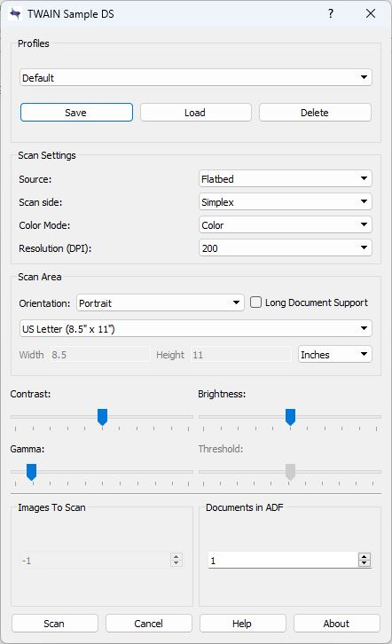

### Installation instructions for the 32-bit TWAIN device

Note:  You may need Administrator Rights on your system to get write access to the directories below.

There are two general ways to install the 32-bit sample TWAIN drivers.  The first method outlines installing the driver automatically using the installer program.

The second method is a "manual" installation, where you will copy the contents of the **sample2** folder directly to the Windows system folder.

Only use the second method if for some reason, the automatic installation fails step 5) outlined below:

### Automatic installation
1) Run the 32-bit installer, [twainds.win32.installer.msi](https://github.com/dynarithmic/twain_library/blob/master/SampleTWAINDevices/twain_32/twainds.win32.installer.msi).  

2) Go to the Windows system directory (usually C:\Windows).  There should be a **twain_32** directory defined there.   Note:  All systems running a modern version of the Windows operating system should already have the **twain_32** directory existing.

3) There should be a subfolder with the name of **sample2** that was created.  In the **sample2** folder should be a file with a **.ds** extension.  This is the main file that the TWAIN Data Source Manager will communicate with when querying the installed TWAIN devices.

4) To check the installation, you can run the DTWDEMO32.exe program [found here](https://github.com/dynarithmic/dtwain/tree/dtwain_apache/binaries), and see if the scanner shows up in the "Select Source" dialog when selecting a Source.  

5) Using DTWDEMO32.exe, attempt to acquire to a bitmap by selecting "Acquire Test -> Acquire Native" from the main menu, and check if the user-interface for the TWAIN device shows up. The user interface should look similar to the following:

!

If there is an error displaying the user-interface above, then a manual installation of the driver may be necessary, outlined in the next series of steps:

### Manual installation

1) Go to the Windows system directory (usually C:\Windows).  There should be a **twain_32** directory defined there.   Note:  All systems running a modern version of the Windows operating system should already have the **twain_32** directory existing.

2) Copy the contents of the [twain32 folder](https://github.com/dynarithmic/twain_library/tree/master/SampleTWAINDevices/twain_32) to the C:\Windows\twain_32 directory.

3) To check the installation, run the DTWDEMO32.exe program [found here](https://github.com/dynarithmic/dtwain/tree/dtwain_apache/binaries), and see if the scanner shows up in the "Select Source" dialog when selecting a Source.

4) Using DTWDEMO32.exe, attempt to acquire to a bitmap by selecting "Acquire Test -> Acquire Native" from the main menu, and check if the user-interface for the TWAIN device shows up. The user interface should look similar to the interface shown in step 5) in the **Automatic installation** instructions.

----------

### Installation instructions for the 64-bit TWAIN device

There are two general ways to install the 32-bit sample TWAIN drivers.  The first method outlines installing the driver automatically using the installer program.

The second method is a "manual" installation, where you will copy the contents of the **sample2** folder directly to the Windows system folder.

Only use the second method if for some reason, the automatic installation fails step 5) outlined below:

1) Run the 64-bit installer, [twainds.win64.installer.msi](https://github.com/dynarithmic/twain_library/blob/master/SampleTWAINDevices/twain_64).  

2) Go to the Windows system directory (usually C:\Windows).  There should be a **twain_64** directory. If there is no directory named twain_64, create the directory (so once done, there will be a C:\Windows\twain_64 directory), and add **C:\Windows\twain_64** to the system PATH.

3) There should be a subfolder with the name of **sample2** that was created.  In the **sample2** folder should be a file with a **.ds** extension.  This is the main file that the TWAIN Data Source Manager will communicate with when querying the installed TWAIN devices.

4) Check in the C:\Windows or C:\Windows\System32 directory for a file named **TWAINDSM.DLL**.  If the file does not exist, copy the version found here in the twain_64 directory to C:\Windows

5) To check the installation, you can run the DTWDEMO64.exe program [found here](https://github.com/dynarithmic/dtwain/tree/dtwain_apache/binaries), and see if the scanner shows up in the "Select Source" dialog when selecting a Source. 

6) Using DTWDEMO64.exe, attempt to acquire to a bitmap by selecting "Acquire Test -> Acquire Native" from the main menu, and check if the user-interface for the TWAIN device shows up. The user interface should look similar to the following:

!

If there is an error displaying the user-interface above, then a manual installation of the driver may be necessary, outlined in the next series of steps:

### Manual installation

1) Go to the Windows system directory (usually C:\Windows).  There should be a **twain_64** directory. If there is no directory named twain_64, create the directory (so once done, there will be a C:\Windows\twain_64 directory), and add **C:\Windows\twain_64** to the system PATH.

2) Once the twain_64 directory exists, copy the contents of the [twain64 folder](https://github.com/dynarithmic/twain_library/tree/master/SampleTWAINDevices/twain_64) to the C:\Windows\twain_64 directory.

3) Check in the C:\Windows directory for a file named **TWAINDSM.DLL**.  If the file does not exist, copy the version found here in the twain_64 directory to C:\Windows

4) To check the installation, you can run the DTWDEMO64.exe program [found here](https://github.com/dynarithmic/dtwain/tree/dtwain_apache/binaries), and see if the scanner shows up in the "Select Source" dialog when selecting a Source. 

5) Using DTWDEMO64.exe, attempt to acquire to a bitmap by selecting "Acquire Test -> Acquire Native" from the main menu, and check if the user-interface for the TWAIN device shows up. The user interface should look similar to the interface shown in step 6) in the **Automatic installation** instructions.
